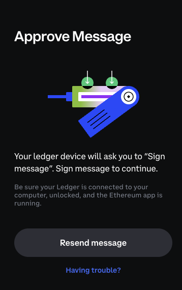
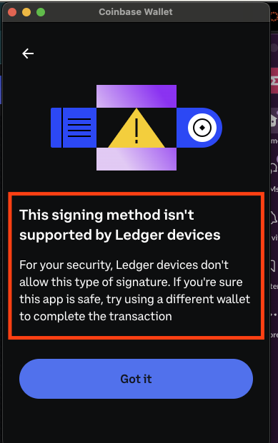

# This app was build to reproduce an issue with coinbase wallet sdk and Ledger Nano device

## Setup

### Install dependencies

```bash
npm install
```

### Run the app

```bash
npm start
```

### Reproduce the issue

1. Connect your Ledger Nano device to Coinbase browser extension
2. Open the app
3. Click on "Connect with Coinbase Wallet" button
4. Connect to the dapp unsing the Ledger Nano device

Note: After connecting the dapp will try to sign a message

5. Click on "Resend message"



### Final result

Now you should see the screen below


